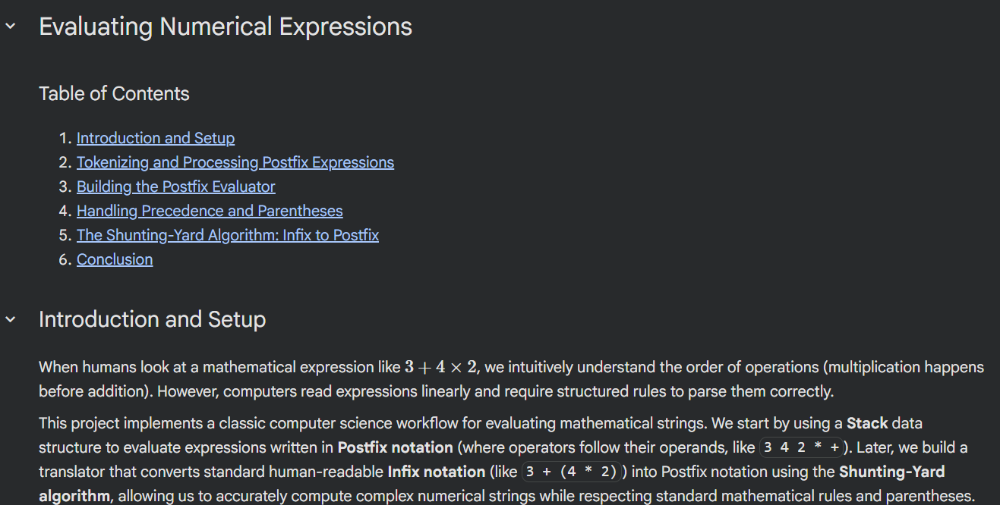

# Evaluating Numerical Expressions

A Python-based mathematical expression parser and evaluator implemented in a Jupyter Notebook. This project uses classic computer science algorithms and data structures to parse complex arithmetic strings and resolve human order-of-operations ambiguities.

## 🚀 Overview

While humans intuitively understand math hierarchy (like PEMDAS), computers read data linearly and require explicit instructions to process nested operations correctly.

This project solves this in two steps:

1. **The Infix Translator:** Uses Edsger Dijkstra’s **Shunting-Yard Algorithm** to translate standard math strings (Infix) into computer-friendly Postfix notation.
2. **The Postfix Engine:** Leverages a custom Stack data structure to evaluate the translated expression linearly in $O(1)$ constant time.

---

## 🛠️ Features & Data Structures

* **Custom Stack:** Built on top of a custom Doubly Linked List to ensure optimal, constant-time `push()`, `pop()`, and `peek()` operations.
* **Precedence Mapping:** Fully maps mathematical operator hierarchy for addition, subtraction, multiplication, division, and exponents.
* **Parentheses Isolation:** Robustly handles deeply nested brackets by isolating sub-expressions and executing them in the correct priority order.

---

## 🧱 Workflow Pipeline

```
[ Infix Input ]       --> "4 * ( 1 + 2 * ( 9 / 3 ) - 5 )"
       |
[ Shunting-Yard ]     --> Sorts operators and numbers using an internal Stack
       |
[ Postfix Output ]    --> "4 1 2 9 3 / * + 5 - *"
       |
[ Postfix Engine ]    --> Resolves the linear data using execution stacks
       |
[ Final Result ]      --> 8.0

```

---

## 📊 Sample Test Coverage

| Infix Input | Internal Postfix Translation | Computed Result |
| --- | --- | --- |
| `1 + 1` | `1 1 +` | **2.0** |
| `1 * ( 2 - ( 1 + 1 ) )` | `1 2 1 1 + - *` | **0.0** |
| `4 * ( 1 + 2 * ( 9 / 3 ) - 5 )` | `4 1 2 9 3 / * + 5 - *` | **8.0** |
| `10 + 3 * 5 / ( 16 - 4 * 1 )` | `10 3 5 * 16 4 1 * - / +` | **11.25** |
| `64 / ( 8 * 8 )` | `64 8 8 * /` | **1.0** |

---

## 📂 File Structure

* `Evaluating Numerical Expressions.ipynb`: Interactive notebook containing code modules, localized testing, and step-by-step conceptual markdown summaries.
* `linked_list.py`: Supporting script containing the custom `LinkedList` implementation used as the foundation for the Stack.

---

[](https://colab.research.google.com/drive/1qNRJcVbdUFjiqV4CgqGQFuJ5IOqvG91F?usp=sharing)

View this project live on Google Colab [here](https://colab.research.google.com/drive/1qNRJcVbdUFjiqV4CgqGQFuJ5IOqvG91F?usp=sharing)
